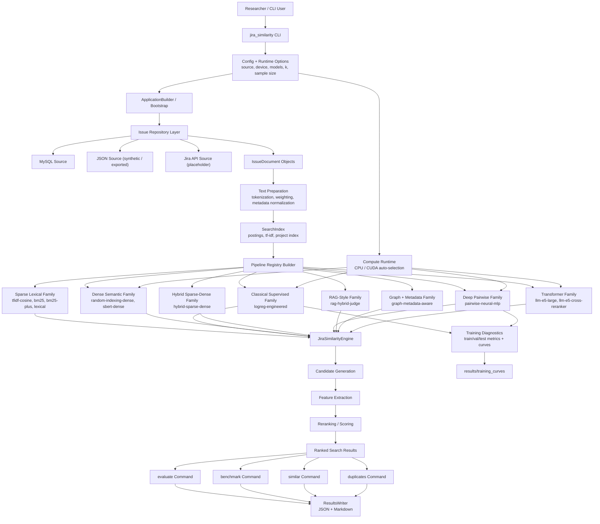

# Jira Similarity

This repository currently implements eight model families for Jira issue similarity and duplicate analysis:

- sparse lexical retrieval
- classical supervised ML with engineered features
- dense semantic embedding models
- hybrid sparse-dense retrieval
- deep pairwise duplicate classification
- LLM-based and RAG-style reasoning
- transformer language-model retrieval/reranking
- graph- and metadata-aware models

The goal is to add one family at a time while keeping the codebase clean, testable, and ready for comparative benchmarking. The dataset lives in [datasets/TAWOS](/C:/workplace/JiraSimilarity/datasets/TAWOS), and the code is organized so data access, preprocessing, retrieval, learning, and evaluation stay separate.

## What is in scope now

- Sparse lexical models:
  - `tfidf-cosine`
  - `bm25`
  - `bm25-plus`
  - `lexical` as a compatibility alias
- Classical supervised models:
  - `logreg-engineered`
- Dense semantic models:
  - `random-indexing-dense`
  - `sbert-dense`
- Hybrid sparse-dense models:
  - `hybrid-sparse-dense`
- Deep pairwise duplicate models:
  - `pairwise-neural-mlp`
- LLM/RAG-style models:
  - `rag-hybrid-judge`
- Transformer language models:
  - `llm-e5-large`
  - `llm-e5-cross-reranker`
- Graph/metadata-aware models:
  - `graph-metadata-aware`
- Source adapters for:
  - MySQL
  - JSON
  - a placeholder Jira API adapter
- A modular retrieval pipeline with:
  - candidate generation
  - feature extraction
  - reranking
- Benchmark and evaluation commands for:
  - similarity retrieval
  - duplicate-oriented retrieval
- Unit tests for the current implemented baselines

## Quick start

Create or activate an environment, then install the project:

```powershell
.\.venv\Scripts\python.exe -m pip install -e .
```

If you want direct MySQL access through Python, install the optional dependency:

```powershell
.\.venv\Scripts\python.exe -m pip install -e .[mysql]
```

If you want GPU acceleration (PyTorch-backed paths for dense scoring and model training), install:

```powershell
.\.venv\Scripts\python.exe -m pip install -e .[gpu]
```

If you want transformer language-model pipelines (E5 embeddings and cross-encoder reranking), install:

```powershell
.\.venv\Scripts\python.exe -m pip install -e .[llm,gpu]
```

If you want saved train/validation/test curve plots for supervised model training diagnostics, install:

```powershell
.\.venv\Scripts\python.exe -m pip install -e .[viz]
```

The runtime supports both GPU and non-GPU machines:

- `--compute-device auto` (default): use CUDA when available, otherwise CPU fallback
- `--compute-device cuda`: request CUDA, fallback to CPU if unavailable
- `--compute-device cpu`: force CPU

You can also set `JIRA_COMPUTE_DEVICE` in the environment.

Set database environment variables:

```powershell
$env:JIRA_DB_HOST = "127.0.0.1"
$env:JIRA_DB_PORT = "3306"
$env:JIRA_DB_NAME = "TAWOS"
$env:JIRA_DB_USER = "root"
$env:JIRA_DB_PASSWORD = "your-password"
```

Run a similarity lookup for a brand-new issue:

```powershell
.\.venv\Scripts\python.exe -m jira_similarity similar `
  --model bm25 `
  --title "Null pointer exception in payment service" `
  --description "Checkout fails when customer profile is missing an address." `
  --project APP
```

Run duplicate-oriented search:

```powershell
.\.venv\Scripts\python.exe -m jira_similarity duplicates `
  --model bm25 `
  --title "Checkout throws null pointer exception" `
  --description "Failure happens when address is empty and totals are recalculated." `
  --project APP `
  --top-k 10 `
  --threshold 0.55
```

Evaluate multiple models against linked issues already in the dataset:

```powershell
.\.venv\Scripts\python.exe -m jira_similarity --log-level INFO evaluate `
  --compute-device auto `
  --task duplicates `
  --models bm25 bm25-plus logreg-engineered random-indexing-dense hybrid-sparse-dense pairwise-neural-mlp rag-hybrid-judge graph-metadata-aware `
  --sample-size 100
```

List the available models:

```powershell
.\.venv\Scripts\python.exe -m jira_similarity models --models all
```

List the named benchmark suites:

```powershell
.\.venv\Scripts\python.exe -m jira_similarity suites
```

Run the same engine against a JSON export instead of MySQL:

```powershell
.\.venv\Scripts\python.exe -m jira_similarity --source json --json-path .\sample-issues.json similar `
  --model bm25 `
  --title "Null pointer exception in payment service" `
  --description "Checkout fails when customer profile is missing an address."
```

Generate and use the built-in synthetic Jira-like JSON dataset (no MySQL required):

```powershell
python scripts\generate_synthetic_jira_dataset.py `
  --output datasets\synthetic\synthetic_jira_issues.json `
  --cluster-count 30 `
  --seed 20260421

.\.venv\Scripts\python.exe -m jira_similarity `
  --source json `
  --json-path datasets\synthetic\synthetic_jira_issues.json `
  --compute-device auto `
  benchmark `
  --task similarity `
  --models bm25 bm25-plus logreg-engineered random-indexing-dense hybrid-sparse-dense pairwise-neural-mlp rag-hybrid-judge graph-metadata-aware `
  --sample-size 100 `
  --top-k-values 1 3 5 10
```

Run a named benchmark suite:

```powershell
.\.venv\Scripts\python.exe -m jira_similarity --log-level INFO benchmark `
  --suite graph-metadata-duplicates `
  --sample-size 100 `
  --top-k-values 1 3 5 10
```

Use `--log-level DEBUG` when you want to see model-building and evaluation progress in more detail.

Training diagnostics are enabled by default for supervised models (`logreg-engineered`, `pairwise-neural-mlp`):

- JSON and CSV curves are saved under `results/training_curves/<model>/`
- Plot images (`*_loss.png`, `*_f1.png`) are generated when `matplotlib` is installed
- To avoid thousands of files during per-query holdout evaluation, saves are capped by default to 3 files/model
  (`JIRA_TRAINING_DIAGNOSTICS_MAX_FILES_PER_MODEL`, use `-1` for unlimited)
- Disable with `--disable-training-diagnostics` or `JIRA_TRAINING_DIAGNOSTICS=0`

## Project structure

- [src/jira_similarity/repository.py](/C:/workplace/JiraSimilarity/src/jira_similarity/repository.py) handles source adapters and keeps input concerns away from retrieval logic.
- [src/jira_similarity/text.py](/C:/workplace/JiraSimilarity/src/jira_similarity/text.py) handles normalization and sparse text preparation.
- [src/jira_similarity/pipeline.py](/C:/workplace/JiraSimilarity/src/jira_similarity/pipeline.py) defines the shared retrieval pipeline contracts.
- [src/jira_similarity/model_families/sparse_lexical.py](/C:/workplace/JiraSimilarity/src/jira_similarity/model_families/sparse_lexical.py) contains the current model family implementation.
- [src/jira_similarity/model_families/classical_supervised.py](/C:/workplace/JiraSimilarity/src/jira_similarity/model_families/classical_supervised.py) contains the supervised engineered-feature family.
- [src/jira_similarity/model_families/dense_semantic.py](/C:/workplace/JiraSimilarity/src/jira_similarity/model_families/dense_semantic.py) contains the dense semantic embedding family.
- [src/jira_similarity/model_families/hybrid_sparse_dense.py](/C:/workplace/JiraSimilarity/src/jira_similarity/model_families/hybrid_sparse_dense.py) contains the hybrid sparse-dense family.
- [src/jira_similarity/model_families/deep_pairwise.py](/C:/workplace/JiraSimilarity/src/jira_similarity/model_families/deep_pairwise.py) contains the neural pairwise duplicate-classification family.
- [src/jira_similarity/model_families/llm_rag.py](/C:/workplace/JiraSimilarity/src/jira_similarity/model_families/llm_rag.py) contains the LLM-style RAG reasoning family.
- [src/jira_similarity/model_families/graph_metadata.py](/C:/workplace/JiraSimilarity/src/jira_similarity/model_families/graph_metadata.py) contains the graph- and metadata-aware family.
- [src/jira_similarity/engine.py](/C:/workplace/JiraSimilarity/src/jira_similarity/engine.py) coordinates search, duplicate filtering, and evaluation.
- [src/jira_similarity/benchmarking.py](/C:/workplace/JiraSimilarity/src/jira_similarity/benchmarking.py) keeps comparative analysis structured.

## System overview diagram



## Current documentation

- Problem statement: [docs/problem-statement.md](/C:/workplace/JiraSimilarity/docs/problem-statement.md)
- Sparse lexical baseline: [docs/sparse-lexical-retrieval.md](/C:/workplace/JiraSimilarity/docs/sparse-lexical-retrieval.md)
- Classical supervised ML: [docs/classical-supervised-ml.md](/C:/workplace/JiraSimilarity/docs/classical-supervised-ml.md)
- Dense semantic embeddings: [docs/dense-semantic-embeddings.md](/C:/workplace/JiraSimilarity/docs/dense-semantic-embeddings.md)
- Hybrid sparse-dense retrieval: [docs/hybrid-sparse-dense-retrieval.md](/C:/workplace/JiraSimilarity/docs/hybrid-sparse-dense-retrieval.md)
- Deep pairwise duplicate classification: [docs/deep-pairwise-duplicate-classification.md](/C:/workplace/JiraSimilarity/docs/deep-pairwise-duplicate-classification.md)
- LLM-based and RAG-style approaches: [docs/llm-rag-style-approaches.md](/C:/workplace/JiraSimilarity/docs/llm-rag-style-approaches.md)
- Graph- and metadata-aware models: [docs/graph-metadata-aware-models.md](/C:/workplace/JiraSimilarity/docs/graph-metadata-aware-models.md)
- Evaluation metrics guide: [docs/evaluation-metrics-guide.md](/C:/workplace/JiraSimilarity/docs/evaluation-metrics-guide.md)
- Synthetic dataset usage: [docs/synthetic-dataset.md](/C:/workplace/JiraSimilarity/docs/synthetic-dataset.md)
- Broader future model ideas: [docs/various-ml-solutions.md](/C:/workplace/JiraSimilarity/docs/various-ml-solutions.md)
